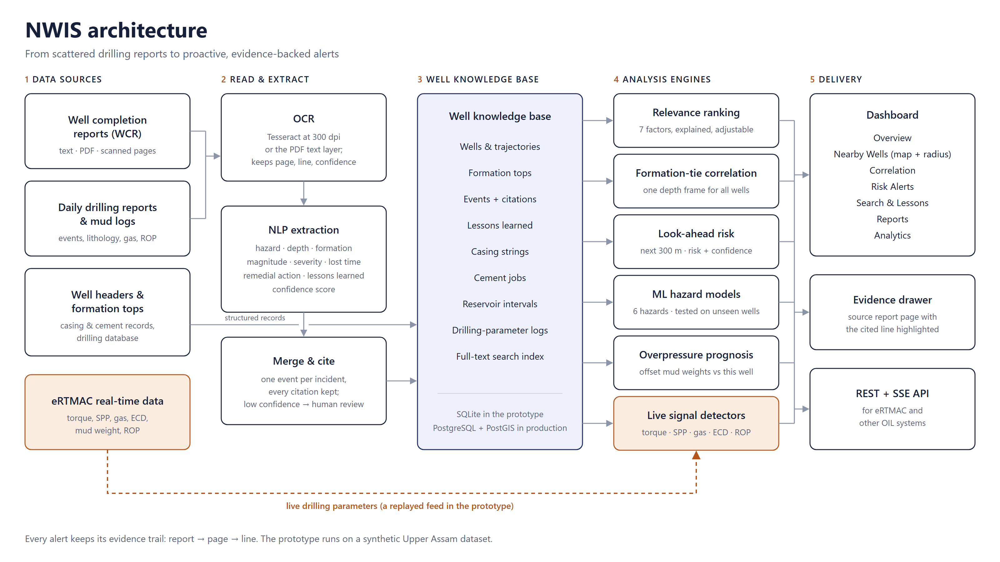

# SIH 2026 Idea Presentation · Slide Content for NWIS

Copy-ready text for every slide of the idea presentation for PS 26121 (Oil India Limited). Prototype figures were checked against the code and a live run on 30 Sep 2026.

- Each slide lists its heading, sub-heading and the text for each box. Paste box by box.
- Fill in everything in [square brackets] (Team ID, Team Name, links).
- Lines labelled Visual or Screenshot are layout tips, not slide text.

---

## Checklist

**Slide heading:** Before You Submit  
**Sub-heading:** A few things only your team can do, and a few that changed while the prototype was being finished.

> **To do**
> - **Slide 1** – fill in your Team ID and Team Name exactly as registered on the SIH portal
> - **Diagram** – use deck-assets/nwis-architecture.png on slide 3 (3200 × 1800 px, white background)
> - **Screenshots** – use the fresh captures in deck-assets/screens (all 7 screens, 3360 × 2040 px, taken 30 Sep from the current build); most files in nwis/docs/screenshots still show older numbers
> - **Crop the evidence-drawer image** – 05-evidence-drawer-source-line.png also shows synthetic DDR lines with a 17-1/2 in bit at about 2,000 m, which an OIL engineer will spot; crop to the highlighted line, or fix the generator first
> - **Prototype fixes** – the Fixes Before the Demo section lists what the OIL-evaluator review found in the prototype itself; hand it to whoever is building NWIS
> - **Numbers** – if the knowledge base is rebuilt, re-run the commands in the Numbers & Sources table and update any figure that changed
> - **GitHub** – push the latest commit before sharing the link: at 02:35 on 30 Sep, the commit with the trained model, search and overpressure work (7cb11ba) was one ahead of GitHub
> - **Repo access** – check that github.com/yassudicoder/eRTMAC-NWIS is public (or shared with the judges) before you put the link on a slide

---

## Slide 1 · Title page

### Title page fields

- **Problem Statement ID** – 26121
- **Problem Statement Title** – eRTMAC-NWIS (Nearby Wells Intelligence System): An AI-Powered Offset Well Knowledge and Decision Support Platform for Drilling Operations
- **Organisation** – Oil India Limited
- **Theme** – Smart Automation
- **PS Category** – Software
- **Team ID** – [your Team ID]
- **Team Name (Registered on portal)** – [your Team Name]

*Check:* PS 26121 is serial no. 121 in the SIH 2026 problem-statement list. Copy the title exactly as the portal shows it.

---

## Slide 2 · Proposed solution

**Slide heading:** NWIS: Nearby Wells Intelligence System  
**Sub-heading:** Turns decades of offset-well drilling records into proactive, evidence-backed guidance for the well being drilled right now.

### Current problems

- **Scattered knowledge** – drilling history sits in well completion reports (WCR), daily drilling reports (DDR), mud logs, scanned PDFs, databases and people's memory
- **No offset-well view** – no single map of nearby wells around the active well
- **Nearest ≠ most relevant** – no multi-parameter way to pick the right analogue wells
- **Depth mismatch** – the same formation lies at different depths in different wells, so raw-depth comparison misleads
- **Reactive, not proactive** – mud losses, kicks, stuck pipe and cementing failures repeat because past events surface too late
- **Slow decisions** – hours of manual report searching before critical calls
- **Knowledge loss** – expertise leaves when experienced engineers retire or transfer
- **Low trust in AI** – black-box outputs are not acted on at the rig site

### Our proposed solution

A standalone AI/ML decision-support platform that runs alongside eRTMAC:

- **OCR + NLP extraction** – reads WCRs, DDRs and mud logs and pulls out each drilling event with depth, formation, severity, lost time (NPT), remedial action and lessons learned
- **Searchable knowledge base** – events, lessons learned, casing programmes, cement jobs, reservoir properties and drilling parameters in one place; one search box covers every event, lesson and report line
- **Nearby-wells map** – interactive map of offset wells within a user-defined radius
- **Relevance-ranked offsets** – a 7-factor similarity score instead of distance alone; every score explained, weights adjustable
- **Cross-well correlation** – formation tops tie each offset well to the active well's depth frame
- **Proactive look-ahead alerts** – risk, confidence, reasons, evidence and recommended actions for the next 300 m ahead of the bit
- **Predictive ML + overpressure prognosis** – per-hazard models trained on offset-well history, plus mud-weight-based overpressure warnings
- **Evidence drawer** – each offset event behind an alert opens at the exact page and line of its source report

### How it addresses the problem

- **PD-i, EO-ii** – geospatial map of offset wells within a user-defined radius of the active well
- **PD-ii, EO-iii** – one click from an alert to the offset event, its report page and the mitigation the crew used; a Search & Lessons screen searches every event, lesson learned and report line
- **PD-iii, EO-iv** – mud losses, kicks, stuck pipe and cementing events are projected across wells through formation ties; drilling parameters are compared formation by formation; casing, cement-job and reservoir records are held for every well
- **PD-iv** – warns before the bit reaches a depth or formation where nearby wells had trouble
- **EO-v** – trained models for mud loss, stuck pipe, kick, wellbore instability, torque & drag and cementing issues, plus a mud-weight check for overpressure, all driven by offset-well history
- **EO-i** – OCR + NLP turn unstructured reports into structured, citable data
- **Institutional memory** – what earlier crews actually did is captured, attributed and reused

### Innovation & uniqueness

- **Relevance, not proximity** – an explained 7-factor ranking that engineers can question and re-weight
- **Formation-tie correlation** – a loss at 2,840 m in an offset is translated to the depth where this well meets the same rock
- **Evidence-first** – every historical event behind an alert traces to document → page → line; overpressure warnings name the offset wells and mud weights they rest on
- **Two views, side by side** – an evidence score built from specific offset events, and a trained model's probability against its base rate
- **One vote per well** – an incident reported in the WCR, DDR and mud log counts once, with all three citations kept
- **Risk and confidence kept separate** – how bad it could be vs how sure we are
- **Crew-proven actions first** – recommendations lead with what offset crews actually did, named by well
- **Lightweight and secure** – core engines use only the Python standard library, so they run on locked-down, on-premise machines

*Visual:* Problems box on the left, solution top right, how-it-helps bottom right: the same layout as the 2024 sample.

*Screenshot:* deck-assets/screens/01-overview.png: map, depth column, risk ahead of the bit and live signals on one screen.

---

## Slide 3 · Technical approach (1 of 2)

**Slide heading:** Technical Approach  
**Sub-heading:** From raw drilling reports to proactive, evidence-backed alerts

### Technologies used

- **Frontend** – React 18 · Vite 5 · Tailwind CSS 3 · Leaflet + React-Leaflet (OpenStreetMap / OpenTopoMap) · Lucide icons · custom SVG depth tracks
- **Backend / API** – Python 3.11+ · FastAPI · Uvicorn · Server-Sent Events for the real-time feed · OpenAPI / Swagger docs
- **Knowledge base & search** – SQLite (WAL) with FTS5 full-text search and BM25 ranking · schema ready for PostgreSQL + PostGIS
- **AI / ML / NLP / OCR** – rule-based NLP extraction engine · logistic-regression hazard models (pure Python) · OCR path for scanned PDFs (Tesseract + PyMuPDF)
- **Analytics** – Haversine geo-distance · formation-tie depth correlation · least-squares trend detection · spatial hazard clustering
- **DevOps** – Docker & Docker Compose · Git / GitHub · automated test suite
- **Production path** – PostgreSQL + PostGIS · WITSML / eRTMAC connector · spaCy models fine-tuned on OIL reports · role-based access + TLS / AES-256 encryption

### Methodology & process flow

1. **Collect** – WCRs, DDRs, mud logs (text, PDF or scanned), formation tops, well headers, casing and cement records, eRTMAC drilling parameters
2. **Read (OCR)** – plain text, PDF text layer or 300-dpi Tesseract OCR, split into pages and lines that keep their source and OCR confidence
3. **Extract (NLP)** – for each line: classify the hazard, filter false triggers, parse depth, magnitude and formation, infer severity, score confidence; attach remedial actions and lessons learned
4. **Merge** – the same incident in WCR, DDR and mud log becomes one event with all citations; low-confidence items are flagged for human review
5. **Store** – one well knowledge base: events, lessons and casing tables read from the reports, plus well headers, formation tops, drilling logs, cement jobs and reservoir data loaded from structured sources, and a full-text index
6. **Find relevant wells** – radius search, then a 7-factor relevance score, giving ranked and explained offset wells
7. **Correlate** – shared formation tops map depths between each offset and the active well
8. **Look ahead** – the next 300 m is projected into every relevant offset; events are grouped by hazard into a risk score, confidence, ML probability and live-signal boost
9. **Deliver** – dashboard, evidence drawer, search & lessons, and a REST / SSE API for eRTMAC integration

*The same diagram as a slide-ready image: deck-assets/nwis-architecture.png (3200 × 1800 px, white background).*

*Visual:* Use deck-assets/nwis-architecture.png as the process-flow image, or draw the nine steps left to right: Collect → Read → Extract → Merge → Store → Find → Correlate → Look ahead → Deliver.

---

## Slide 4 · Technical approach (2 of 2)

**Slide heading:** Inside the NWIS Engines  
**Sub-heading:** Relevant wells → a common depth frame → risk ahead of the bit

### A · Picking a relevant nearby well

1. **Candidates** – completed wells within the user's radius (default 15 km)
2. **7 factors, default weights** – geological similarity 26% · proximity 18% · historical experience 15% · depth coverage 14% · drilling parameters (ROP, WOB, RPM, mud weight) 12% · trajectory 10% · recency 5%
3. **Combine** – relevance from 0 to 1: High ≥ 0.68, Medium ≥ 0.45, otherwise Low
4. **Explain** – each factor shows score × weight = contribution, with reasons for and against

### B · Cross-well correlation

- **Tie points** – formation tops shared by both wells, mapped by piecewise-linear interpolation
- **Tie quality** – from the number of ties and how consistent their depth shifts are; weak correlations are flagged

### C · Proactive look-ahead risk

- **Window** – the next 300 m of hole, adjustable from 50 to 1,000 m
- **Projection** – offset events mapped to this well's depth; one vote per well
- **Score** – risk = recurrence × severity × depth agreement, plus up to +0.20 when the current well already shows the symptom
- **Bands** – High ≥ 0.62, Medium ≥ 0.35; confidence reported separately

### D · Predictive ML models

- **Six hazards** – mud loss, stuck pipe, kick, wellbore instability, torque & drag, cementing issue: one logistic-regression model each
- **13 features** – offset incidence and severity, distance to the nearest affected offset, formation base rate, depth, modelled overbalance, reservoir depletion, estimated fracture margin, porosity, permeability, hole angle
- **Validation** – leave-one-well-out, so every well is scored by a model that never saw it: ROC-AUC 0.82 (mud loss) to 0.93 (torque & drag), better than the base-rate baseline on Brier score for all six
- **Explainable** – each probability lists its top drivers

### E · Overpressure / mud-weight prognosis

- **Evidence** – the mud weight offset crews needed to drill each formation without influx (an upper bound on pore pressure), mapped onto this well through formation ties
- **Warning** – when offsets needed ≥ 0.06 sg more mud than this well carries, or the drilling margin (estimated fracture gradient − offset mud weight) is ≤ 0.22 sg (critical at ≤ 0.12 sg)
- **Guard** – needs readings from at least two offset wells at the correlated depth
- **Production** – fracture gradient from offset LOT/FIT data instead of the regional model

### F · Live signals from the current well

Trend detectors over the last 120 m of the current well's parameters. A matching trend raises an alert that offset history already supports:

- **Rising torque** – supports torque & drag, stuck pipe, wellbore instability and tight-hole alerts
- **Rising standpipe pressure** – supports bit-balling and tight-hole alerts
- **Rising background gas or low modelled overbalance** – early warning of a shrinking overbalance; primary kick detection (pit gain, flow-out) stays with eRTMAC and the driller
- **ECD close to fracture gradient** – supports mud-loss alerts
- **Falling ROP** – supports low-ROP and bit-balling alerts

### G · Casing & cementing intelligence

- **Records** – casing programme and cement jobs for every well: top of cement, excess, returns, bond quality
- **Comparison** – the API maps offset casing shoes to their equivalent depth in this well through formation ties

### H · Example output (synthetic pilot data)

- **Situation** – Moran-68 is drilling at 1,815 m MD; NWIS looks 300 m ahead using the 8 offset wells within 15 km
- **MEDIUM · Stuck pipe (risk 0.57, confidence 0.86)** – 2 relevant offsets had stuck pipe in the Tipam Sandstone just below the bit, costing 73 h of NPT; 8 source references
- **Closest analogue** – Moran-61 (1.3 km, relevance 0.90) had 56.9 t overpull at 1,990 m MD, which correlates to 1,998 m MD in Moran-68; one click opens that line in Moran-61's daily drilling report
- **Model second opinion** – 37% probability of stuck pipe, 2.2× the 17% base rate
- **Mud-weight warning, 200 m ahead** – offset wells drilled the Barail Coal Shale with up to 1.20 sg mud; Moran-68 carries 1.08 sg

*Screenshot:* deck-assets/screens/04-alert-evidence-and-model.png (the stuck-pipe alert in box H) and 05-evidence-drawer-source-line.png (the cited DDR line); 02-nearby-wells-map-and-ranking.png and 06-cross-well-correlation.png for boxes A and B.

---

## Slide 5 · Feasibility & viability

**Slide heading:** Feasibility & Viability  
**Sub-heading:** Built on proven, open technology, and already working end to end

### Why it is feasible

- **Working prototype** – the full chain from raw reports to cited risk alerts runs today: a 7-screen dashboard, a documented REST API and 39 automated tests, all passing
- **Realistic pilot dataset** – 61 wells across 10 Upper Assam fields (Naharkatiya, Moran, Duliajan, Hugrijan, Tengakhat and more) and 180 reports (657 pages), built on the region's published stratigraphy from Dihing to basement
- **Measured, not claimed** – 1,284 report mentions merged into 547 cited events · extraction precision 100% and recall 99.1% against the generator's answer key · ML AUC 0.82–0.93 on unseen wells · 70 recurring hazard clusters found from report text alone, including 4 of 7 hidden test zones
- **Data already exists at OIL** – WCRs, DDRs, mud logs, formation tops and eRTMAC feeds are recorded today
- **Proven, open-source technology** – no licence cost and no vendor lock-in
- **Non-intrusive integration** – read-only REST and streaming API; only the connector module changes to go live on eRTMAC / WITSML

### Challenges → our approach

- **Scattered, inconsistent, scanned records** – OCR + NLP with confidence scores; low-confidence items flagged for human review
- **Nearest well may not be relevant** – explained 7-factor relevance with adjustable weights
- **Same formation at different depths** – formation-tie correlation with a tie-quality score
- **Wrong or invented AI output** – every extracted event is cited to document, page and line; confidence is shown separately from risk; model accuracy is published
- **No live eRTMAC access during the prototype** – a simulated real-time connector replays drilling logs, ready to swap for the live feed
- **Proprietary, sensitive data** – a synthetic but geologically realistic dataset for the prototype; production runs on-premise with role-based access and encryption
- **Few offset wells drilled a formation** – every alert states how many wells support it and flags single-well evidence
- **Scaling to thousands of wells** – PostGIS spatial indexing and a stateless API

### Implementation roadmap

1. **Phase 1 · Prototype (done)** – core modules, synthetic Upper Assam dataset, dashboard, validated models
2. **Phase 2 · Pilot (3–6 months)** – one Upper Assam structure with OIL's real WCR, DDR and mud-log archive (including scanned reports) plus an eRTMAC link; tune NLP on labelled reports; retrain and re-validate models; add report upload, a review queue and lesson authoring so the knowledge base keeps growing
3. **Phase 3 · Scale** – all OIL operating areas, live WITSML / eRTMAC, single sign-on and role-based access, rig-site view

### Viability

- **Cost-effective** – open-source stack on existing servers; no per-user licences
- **Large archive to learn from** – OIL has completed 3,000+ wells, and 74 in FY 2025-26 alone, so every new well has offset history behind it [1][2]
- **Proven payoff** – planning a deep well in northeast India with drilling records from earlier wells saved 15 rig days [3]
- **Big target** – in the Netherlands, an estimated 20% of drilling time goes to recovering from unexpected, potentially avoidable incidents [4]
- **Reusable** – works for any operator or basin that has an offset-well archive

*Screenshot:* deck-assets/screens/08-reports-and-extraction.png shows the live ingestion statistics (180 documents, 657 pages, 1,284 mentions merged into 547 events).

---

## Slide 6 · Impact & benefits

**Slide heading:** Impact & Benefits  
**Sub-heading:** From historical knowledge to safer, smarter and more efficient drilling

### Impact on the people who use it

- **Drilling engineers** – relevant offset experience and risk warnings in seconds, before the bit reaches the interval
- **Geologists** – automatic cross-well correlation and formation-wise event history
- **Rig and operations teams** – fewer surprises, crew-proven mitigation steps, less non-productive time
- **OIL management** – recurring hazard zones and NPT by hazard and formation at a glance; institutional knowledge retained

### Benefits

- **Economic** – cuts avoidable NPT; better casing, mud and cement design from past lessons; lower well cost
- **Safety & social** – earlier warning of kicks and well-control risk; knowledge shared across teams and generations; a data-driven culture
- **Environmental** – fewer well-control incidents; less drilling fluid lost to formations; fewer sidetracks and re-drills, so less waste and emissions
- **National** – India imported 88.7% of the crude oil it used in 2025-26 (provisional), a US$123.4 billion bill, while domestic output fell to 28.0 MMT [9]; safer, faster domestic drilling supports energy security, Atmanirbhar Bharat and Viksit Bharat 2047

### Why it matters

- **Offset experience drives well planning** – a well's risk assessment is largely based on offset-well experience [4]
- **Wellbore problems dominate lost time** – stuck pipe and borehole problems made up over 24% of drilling and workover NPT in one operator's shaly formations [5]; lost circulation is about 12% of NPT worldwide and costs the industry roughly USD 1–2 billion a year [6][7]
- **Upper Assam is a hard section** – overpressure has been mapped in the Barail and Kopili formations of the upper Assam Shelf [8], and OIL reports high torque, drag, stuck pipe and washouts in high-angle Eocene wells [2]
- **The approach is recommended** – a study that text-mined drilling reports from 93 wells recommended a field-specific database of wellbore problems so crews can forecast and counteract issues [10]

*Screenshot:* deck-assets/screens/09-analytics-npt-and-hazard-zones.png: lost time by hazard and by formation, and the recurring hazard zones found from the reports.

---

## Slide 7 · Research & references

**Slide heading:** Research & References  
**Sub-heading:** Every figure on these slides is traceable to one of these sources; all links were opened and checked on 30 Sep 2026.

### Sources for the figures on these slides

- [1] Oil India Limited, “Drilling” (official website) – https://www.oil-india.com/drilling
- [2] Oil India Limited, Integrated Annual Report 2025-26 – https://www.oil-india.com/files/financial_results_documents/IntegratedAnnualReport2025-26.pdf
- [3] Bhardwaj, Baruah, Sharma & Kumar, “Successful Drilling of Deep Wells Aided by Geomechanical Analysis and Real-Time Decision Making in Complex Geological Setting in the North-Eastern Part of the India”, SPE-200627-MS, 2020 – https://onepetro.org/SPEEURO/proceedings-abstract/20EURO/3-20EURO/D031S023R004/452415
- [4] Hoetz, Jaarsma & Kortekaas, “Drilling Hazards Inventory: The Key to Safer – and Cheaper – Wells”, SPE-166254-MS, 2013 – https://onepetro.org/SPEATCE/proceedings-abstract/13ATCE/13ATCE/D021S028R003/172621
- [5] Aljubran, Al-Yami & Madan, “Best Practices to Prevent Stuck Pipe Incidents in Offshore Shaly Formations”, SPE-183717-MS, 2017 – https://onepetro.org/SPEMEOS/proceedings-abstract/17MEOS/17MEOS/D031S031R005/194632
- [6] Arshad et al., “Engineered Solution to Reduce the Impact of Lost Circulation During Drilling and Cementing in Rumaila Field, Iraq”, IPTC-18245-MS, 2015 – https://onepetro.org/IPTCONF/proceedings-abstract/15IPTC/15IPTC/D041S038R001/153565
- [7] Omer et al., “Successfully Curing Dynamic Losses in a Highly Fractured Reservoir Section…”, SPE-219656-MS, 2024 – https://onepetro.org/SPEAPDT/proceedings-abstract/24APDT/24APDT/D021S011R007/547985
- [8] Rai, Singha & Chatterjee, “3D pore pressure modeling and overpressure zone prediction in the upper Assam Shelf, India”, Acta Geophysica 70, 2022 – https://link.springer.com/article/10.1007/s11600-022-00771-1
- [9] Petroleum Planning & Analysis Cell (MoPNG), India's Oil & Gas Ready Reckoner FY 2025-26 – https://ppac.gov.in/download.php?file=rep_studies/1784899305_The_PPAC_Ready_Reckoner_FY_2025%E2%80%9326_Final.pdf
- [10] Krygier, Solarin & Orozova-Bekkevold, “A Drilling Company's Perspective on Non-Productive Time (NPT) Due to Well Stability Issues”, SPE-200732-MS, 2020 – https://onepetro.org/SPEBERG/proceedings-abstract/20BERG/20BERG/448663

### Related research, geology & standards

- [11] Selveindran et al., “Smart Custom Well Design Based On Automated Offset Well Analysis”, SPE-201590-MS, 2020 – https://onepetro.org/SPEATCE/proceedings-abstract/20ATCE/3-20ATCE/D031S035R008/449989
- [12] Parmar et al., “Complex Risk Assessment of Offset Wells Using Cognitive Analysis”, IPTC-24705-MS, 2025 – https://onepetro.org/IPTCONF/proceedings-abstract/25IPTC/25IPTC/641203
- [13] Hoffimann et al., “Sequence Mining and Pattern Analysis in Drilling Reports with Deep Natural Language Processing”, SPE-191505-MS, 2018 – https://onepetro.org/SPEATCE/proceedings-abstract/18ATCE/18ATCE/D031S033R004/213662
- [14] Guillot et al., “Machine Learning Prediction of the Lost Circulation Events at the Well Planning Stage”, OTC-34764-MS, 2024 – https://onepetro.org/OTCASIA/proceedings-abstract/24OTCA/2-24OTCA/541868
- [15] Directorate General of Hydrocarbons, National Data Repository, “Assam Arakan Basin” – https://www.ndrdgh.gov.in/NDR/index.php/?page_id=617
- [16] Wandrey, “Sylhet-Kopili/Barail-Tipam Composite Total Petroleum System, Assam Geologic Province, India”, USGS Bulletin 2208-D, 2004 – https://pubs.usgs.gov/bul/2208/D/b2208-d_508.pdf
- [17] Energistics, “WITSML Data Standards” – https://energistics.org/witsml-data-standards
- [18] Tool documentation: FastAPI (https://fastapi.tiangolo.com), SQLite FTS5 (https://www.sqlite.org/fts5.html), Tesseract OCR (https://tesseract-ocr.github.io/tessdoc/), PostGIS ST_DWithin (https://postgis.net/docs/ST_DWithin.html), Leaflet (https://leafletjs.com)

*Tip:* If space is tight, keep [1]–[10] (they back the numbers on your slides) and two or three of [11]–[18].

---

## Reference · Every prototype number on the slides

**Slide heading:** Numbers & Sources  
**Sub-heading:** Measured on the synthetic Upper Assam dataset on 30 Sep 2026. Run the command in the last column to re-check a figure.

| What | Value | Re-check with |
|---|---|---|
| Wells and fields | 61 wells (58 completed, 3 drilling) · 10 fields | data/synthetic/wells.json |
| Reports read | 180 (58 WCR, 61 DDR, 61 mud logs) · 657 pages · 28,807 lines | python scripts/score_extraction.py |
| Events | 1,284 mentions → 547 events · 2,094 citations · 15,362 h NPT | python scripts/score_extraction.py |
| Knowledge base | 276 lessons · 193 casing strings · 129 cement jobs · 109 reservoir intervals · 20,592 log samples | data/nwis.db |
| Search index | 25,451 rows: every event, lesson and report line | data/nwis.db (search_index) |
| Extraction accuracy | precision 100% · recall 99.1% · depth error 0.02 m · severity exact 91.6% | python scripts/score_extraction.py |
| Hazard models | 6 hazards · 13 features · leave-one-well-out AUC 0.82–0.93 | python scripts/train_risk_model.py |
| Discovery check | 70 hazard clusters · 4 of 7 hidden test zones found · 3/3 wells rank own structure top 5 | python scripts/validate_discovery.py |
| Tests | 39 of 39 pass | python -m pytest backend/tests -q |
| Relevance weights | geology 26% · proximity 18% · experience 15% · depth 14% · parameters 12% · trajectory 10% · recency 5% | backend/app/engine/relevance.py |
| Look-ahead defaults | 300 m window · 15 km radius · top 12 offsets | backend/app/config.py |

*Honest framing:* Extraction and model scores are measured on a synthetic, templated corpus. Present them as proof that the pipeline works end to end, not as accuracy on OIL's real archive.

---

## For the build team · Found by the OIL-evaluator review

**Slide heading:** Fixes Worth Making Before the Demo  
**Sub-heading:** These change the prototype, not the slides. Most important first.

### Prototype fixes

1. **Hide formation tops below the bit** – drilling wells carry the dataset's true deeper tops (Moran-68's Barail Coal Shale at 1,999.9 m is marked “picked” while the bit is at 1,815 m); use the anchored regional prognosis with a depth uncertainty instead
2. **Make the overpressure warning earn its HIGH** – today risk = 0.34 + 0.13 × severity, so every warning is HIGH (0.73), and confidence is 0.93 whenever four offsets exist; list only offsets that had mud-weight readings, show a consensus value beside the maximum, and call it a mud-weight step-up unless gas, kick or d-exponent evidence supports overpressure
3. **Reconcile “raise mud weight” with sticking risk** – check exposed depleted sands and the shoe FIT before recommending more mud weight; Moran-68's open 12-1/4 in hole includes the depleted Tipam where NWIS also warns of differential sticking
4. **Date-filter the model's offsets** – train each well only on offsets completed before it was spudded, and publish an offset-count baseline beside the AUC
5. **Put casing, cementing and reservoir data on screen** – the casing-comparison and reservoir API endpoints exist, but no dashboard view calls them
6. **Add a torque-spike detector** – the problem statement says “torque spikes”; today there is only a 120 m torque trend
7. **Exercise OCR** – add a few scanned PDFs to the corpus, accept TIFF/PNG scans, and report OCR accuracy separately
8. **Fix synthetic-report errors visible in the evidence drawer** – a 17-1/2 in bit logged below the 13-3/8 in shoe, “drilling blind” used for partial losses, bond index 0.11 called “poor to fair”, caliper readings in day-1 DDRs, bbl mixed with m³
9. **Give institutional memory a write path** – report upload, a review queue for low-confidence extractions, and lesson authoring
10. **One word on the Nearby Wells screen** – it says “six dimensions” beside seven weight sliders

---

## Prepare · Likely judge questions

**Slide heading:** Questions to Expect  
**Sub-heading:** Short, defensible answers that match what the prototype actually does.

**Q: Is this Oil India's real data?**  
A: No. The prototype runs on a synthetic Upper Assam dataset built from published stratigraphy, field locations and the hazards each formation is known for. The app never reads the generator's answer key: it re-reads the generated reports through its own OCR and NLP pipeline, exactly as it would read OIL's archive. The pilot phase moves to OIL's real reports.

**Q: Where exactly is the AI/ML?**  
A: In three places. NLP extracts events from report text (with OCR for scans). Six trained logistic-regression models predict hazards and are validated on wells they never saw. Analytics rank relevance, correlate depths, detect parameter trends and find recurring hazard zones. We chose explainable models because an engineer has to be able to audit why an alert fired.

**Q: Why not a deep-learning model or an LLM?**  
A: There is no labelled corpus of OIL drilling reports to train one on yet, and every extracted fact has to trace back to a line in a report. The rule-based extractor gives that traceability today. Its lexicon maps onto a spaCy pipeline, and the extraction scorecard lets a trained model replace it once labelled data exists.

**Q: An AUC above 0.9 looks too good. Is it overfitting?**  
A: Validation is leave-one-well-out, and a well's own events never enter its own features. But the pilot data is synthetic, so its hazard patterns are cleaner than a real archive's. We expect lower AUC on OIL data, which is why the pilot retrains and re-validates on real outcomes and publishes the metrics.

**Q: How do you handle old scanned or handwritten reports?**  
A: The OCR path is built for scanned PDFs: Tesseract at 300 dpi, with OCR confidence lowering the confidence of everything read from that page. The pilot corpus is text, so OCR accuracy is not measured yet; the pilot adds scanned OIL reports and reports OCR-path accuracy separately. Handwriting would need manual digitisation or a handwriting-recognition model.

**Q: What does the ML add over simply counting offsets that had the problem?**  
A: On the synthetic pilot, not much: a relevance-weighted offset count scores almost the same AUC. The model's value today is a calibrated probability with its base rate and the drivers behind it. The pilot re-validates on OIL's real outcomes and publishes the gain over that simple baseline.

**Q: Could a later well leak into the training of an earlier one?**  
A: Yes, today offsets are not filtered by date, although a well's own events never enter its own features. The next step is to use only offsets completed before each well was spudded and re-publish the metrics.

**Q: How do you know the formation tops ahead of the bit?**  
A: In the pilot data the active wells' deeper tops come from the dataset. In real use they come from the geological prognosis anchored on the well's own picks, with its depth uncertainty carried into the alert interval.

**Q: How does new knowledge get in after go-live?**  
A: Today ingestion is a batch rebuild from the report archive. Phase 2 adds report upload, a review queue to accept or correct extractions, and lesson authoring, so the institutional memory keeps growing.

**Q: Why these relevance weights?**  
A: They are expert priors, and engineers can change them with sliders. In the pilot they are fitted to maximise look-ahead hit rate on held-out wells.

**Q: How does NWIS connect to eRTMAC?**  
A: It runs alongside eRTMAC as a standalone, read-only service. Live drilling parameters come in through one connector module, which today replays recorded logs; in production that module becomes a WITSML or eRTMAC client. eRTMAC or any other system can pull NWIS results through the REST API.

**Q: What if no nearby well has drilled that formation?**  
A: Every alert states how many offset wells support it, single-well evidence is flagged, and the look-ahead shows how many offsets it used. Thin coverage lowers confidence instead of producing false certainty.

**Q: Why isn't the nearest well the best offset?**  
A: On a dipping, faulted shelf, geology and depth matter more than distance. NWIS scores seven factors with geology weighted highest, so a well 9 km away on the same structure can outrank one 2 km away that stopped above the section of interest.

**Q: How is sensitive data protected?**  
A: Production runs on OIL's own servers with role-based access and encryption, so no data leaves the network. The prototype uses only synthetic data.

**Q: Will it scale to all of OIL's wells?**  
A: Candidate selection moves to a PostGIS spatial index, the API is stateless, and ingestion runs as an offline batch. On the pilot, reading all 180 reports takes under a second.

---

Prepared on 30 Sep 2026 from the NWIS repository (github.com/yassudicoder/eRTMAC-NWIS). Prototype figures come from the synthetic Upper Assam dataset; re-run the listed scripts if the knowledge base is rebuilt.
