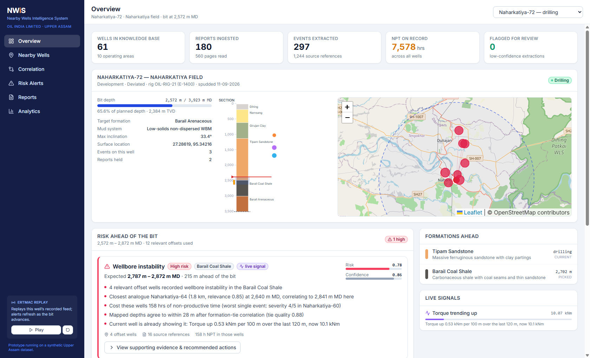
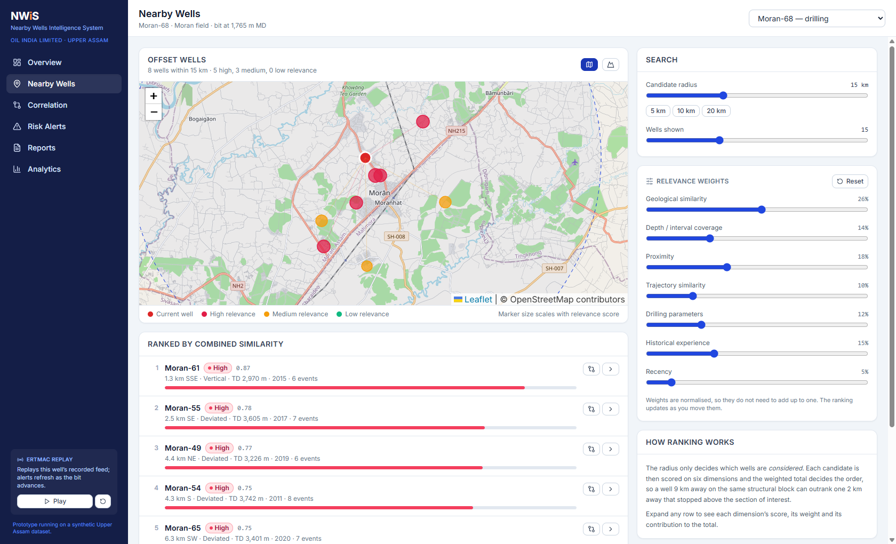
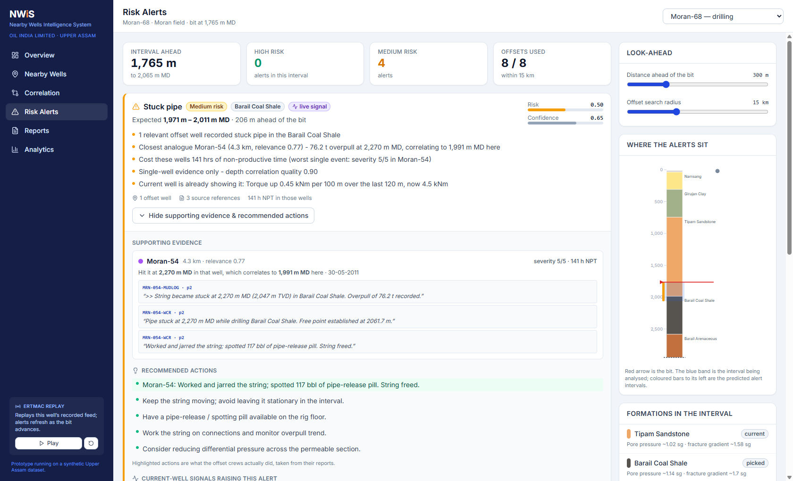
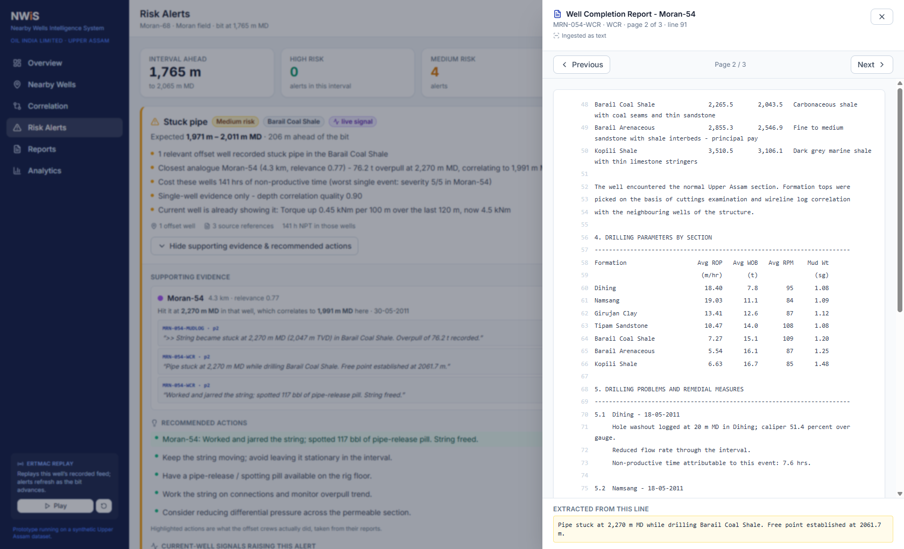
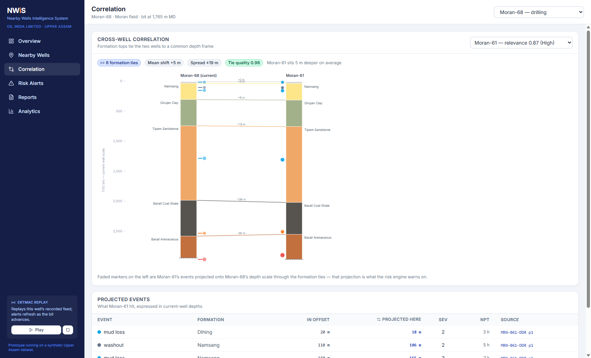
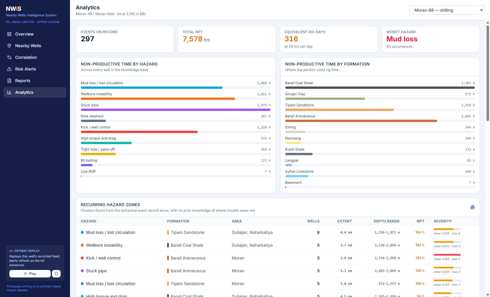

# NWIS — Nearby Wells Intelligence System

**Smart India Hackathon 2026 · Oil India Limited · Upper Assam pilot**

Turns OIL's scattered historical drilling record into proactive, evidence-backed
guidance for the well that is drilling right now.

> The bit is at 2,572 m. Four relevant offset wells hit unstable coal shale in
> the interval 215 m ahead. Here is what happened, here is the page of the
> report it is written on, and here is what those crews did about it.

---

## What it does

| Stage | What happens |
|---|---|
| **Ingest** | Well completion reports, daily drilling reports, mud logs and eRTMAC parameter logs are read in. Text, PDF text layers and scanned pages (Tesseract) all come out the same shape: pages of text with a line-level provenance trail. |
| **Extract** | A rule-based NLP cascade pulls drilling events out of report prose — hazard type, depth, formation, magnitude, NPT — and records the document, page and line each one came from. |
| **Correlate** | Shared formation tops tie wells to a common depth frame, so "2,840 m in that well" becomes "2,910 m in this one" rather than being compared naively. |
| **Rank** | Offset wells are scored on six independent dimensions — geology, depth coverage, distance, trajectory, drilling parameters and recorded experience — not distance alone. Every score is broken down and explained. |
| **Alert** | The interval ahead of the bit is mapped into each relevant offset well, historical events there are grouped and scored, and the current well's own live parameter trends are folded in. |

Every alert can be clicked through to the exact page and line of the original
report.

---

## Quick start

Requires **Python 3.11+** and **Node 20+**. The backend needs FastAPI and
uvicorn and nothing else — no numpy, pandas or scikit-learn.

```bash
# 1. dependencies
pip install -r backend/requirements.txt
cd frontend && npm install && cd ..

# 2. generate the synthetic Upper Assam dataset  (~1 second)
python scripts/generate_assam_dataset.py

# 3. build the well knowledge base: ingest, extract, index  (~2 seconds)
python scripts/seed_db.py

# 4. build the dashboard
cd frontend && npm run build && cd ..

# 5. run
cd backend && uvicorn app.main:app --port 8000
```

Then open **http://localhost:8000**. API docs are at `/docs`.

For frontend development, run `npm run dev` in `frontend/` (port 5173, proxies
`/api` to port 8000) alongside `uvicorn app.main:app --reload`.

With Docker: `docker compose up --build`, then open http://localhost:8000.

### Check it works

```bash
python backend/tests/test_nwis.py       # 28 tests, no pytest required
python scripts/score_extraction.py      # how well the NLP reads the reports
python scripts/validate_discovery.py    # does the analysis find what is there?
python scripts/demo_lookahead.py        # the whole chain, in the terminal
```

---

## The dataset is synthetic, and that matters

No real OIL data was available, so `scripts/generate_assam_dataset.py` builds a
representative Upper Assam dataset: **61 wells across 10 fields, 180 reports,
577 pages**, with realistic well headers, trajectories, casing programmes,
formation tops and depth-indexed drilling parameters.

The geology is not invented. The stratigraphic column (Dihing → Namsang →
Girujan Clay → Tipam Sandstone → Barail Coal Shale → Barail Arenaceous →
Kopili → Sylhet Limestone → Langpar → Archean basement), the regional SE dip,
the field locations around Duliajan, Naharkatiya and Moran, and the hazards
each formation is prone to all come from open literature on the Upper Assam
shelf. See [`docs/data.md`](docs/data.md).

**The application never reads the generator's internal state.** It re-reads the
generated reports through its own ingestion pipeline and extracts events from
the prose, exactly as it would from a scanned WCR. The generator's event list
exists only so extraction can be scored against it.

---

## Results

### Information extraction

`python scripts/score_extraction.py` compares what the extractor read out of the
reports against what the generator wrote into them:

```
Documents ingested     : 180  (577 pages, 24,885 lines)
Raw mentions found     : 828
After evidence merge   : 317
Precision              : 100.0%
Recall                 : 100.0%
Depth MAE (matched)    :  0.00 m
Severity exact match   :  97.8%
Formation correct      : 100.0%
```

**Read this honestly.** The corpus is templated, so its phrasing variety is far
narrower than a real archive of hand-written WCRs going back decades. These
numbers show the pipeline is complete and correct end to end; they are *not* a
prediction of accuracy on OIL's real records. What transfers is the harness:
point `scripts/score_extraction.py` at labelled real reports and it gives the
same scorecard, which is how the lexicon would be tuned during a pilot.

### Discovery validation

`python scripts/validate_discovery.py` asks a harder question. The generator
plants a handful of hazard zones — places where a specific problem recurs in a
specific formation. The application is never told where they are. It reads the
reports, extracts events, and clusters them:

```
Naharkatiya Tipam depleted fairway          yes    9 wells
Naharkatiya Tipam differential-sticking     yes    6 wells
Duliajan-Hugrijan coal caving trend         yes    5 wells
Moran Barail over-pressure cell             yes    3 wells
Dikom Girujan swelling-clay zone            yes    4 wells
Jorajan Kopili pressure ramp                no     (3 wells reached it, too few recorded it)
Tengakhat fractured Sylhet corridor         no     (0 wells reached the Sylhet)

Rediscovered from reports : 5 / 7
```

The two misses are the interesting part: they are zones that almost no well in
the area drilled through. Offset intelligence can only see hazards that enough
offset wells penetrated — a real limit of the method, not a bug in the
implementation, and the script says so explicitly rather than quietly scoring
itself down.

Relevance ranking also passes its sanity check: all three drilling wells rank
their own structure into the top five offsets.

---

## Repository layout

```
backend/
  app/
    assam_geology.py      Upper Assam stratigraphy, fields, faults, hazards
    store.py              well knowledge base (SQLite, PostGIS-portable schema)
    config.py, deps.py    settings and shared dependencies
    main.py               FastAPI app, serves the dashboard build
    ingest/
      ocr.py              text / PDF / Tesseract intake, page-level provenance
      extract.py          rule-based NLP: hazards, depths, magnitudes, severity
      pipeline.py         corpus -> structured events with citations
    engine/
      geometry.py         trajectory: MD <-> TVD, below the bit as well as above
      correlate.py        formation-tie depth mapping between wells
      relevance.py        six-dimension offset ranking
      signals.py          live parameter trend detection
      risk.py             look-ahead risk scoring and evidence assembly
    routers/              wells, analysis, documents, analytics, realtime
  tests/test_nwis.py      28 tests
frontend/                 React + Tailwind + Leaflet dashboard
scripts/
  generate_assam_dataset.py
  seed_db.py
  score_extraction.py
  validate_discovery.py
  demo_lookahead.py
docs/
  architecture.md         how it fits together, and the production path
  data.md                 what the synthetic dataset contains and why
```

---

## Key API endpoints

Full interactive documentation at `/docs`.

| Endpoint | Purpose |
|---|---|
| `GET /api/wells/{id}/offsets` | Ranked offset wells with per-dimension breakdown. Weights are tunable via `w_geology`, `w_distance`, … |
| `GET /api/wells/{id}/risk` | Look-ahead alerts for the interval past the bit, with evidence and recommended actions |
| `GET /api/wells/{id}/correlation/{offset_id}` | Formation ties and the offset's events projected onto this well's depth scale |
| `GET /api/wells/{id}/signals` | Live trend detectors over the parameter feed |
| `GET /api/documents/{id}/page/{page}` | The source page behind any citation |
| `GET /api/analytics/clusters` | Recurring hazard zones found from the event record |
| `GET /api/realtime/{id}/stream` | Simulated eRTMAC feed (SSE): frames plus re-issued alerts as the bit advances |

---

## Design decisions worth knowing

**Correlation on formation tops, not raw depth.** The Upper Assam shelf dips
south-east and is cut by NE–SW faults, so the Barail pay can sit 300 m deeper
in a well 4 km away. Warning a driller at 2,840 m because an offset lost
returns at 2,840 m produces alerts nobody trusts. NWIS ties wells on shared
picked tops and maps depth between them by piecewise-linear interpolation —
what a geologist does by hand when flattening a correlation panel.

**Relevance is explained, not asserted.** Each of the six dimensions is scored
and reported separately with its weight and contribution, and the weights are
exposed as sliders in the UI. "High relevance" with no reasoning is not
something an engineer will act on.

**Rules, not a trained model, for extraction.** There is no labelled corpus of
OIL drilling reports to train on; report language is highly formulaic; and
every extraction has to be traceable to a line on a page. A rule tells you why
it fired. The lexicon and matcher structure map directly onto a spaCy
`Matcher` pipeline, which is the production path once labelled data exists.

**One vote per well.** A well whose WCR, DDR and mud log all mention the same
loss zone contributes one vote to a risk alert, not three — but all three
citations are attached as evidence.

**Confidence is carried, not discarded.** Low-confidence extractions are
flagged for human review rather than silently dropped, and corroboration across
independent documents raises confidence.

**What the crews actually did comes first.** A recommendation reading
"Naharkatiya-60: circulated hi-vis sweeps and back-reamed the interval" carries
more weight on a rig floor than generic best practice — so it is shown first
and attributed, with the standing guidance for that hazard underneath.

---

## From prototype to production

| Now | Production |
|---|---|
| SQLite | PostgreSQL + PostGIS; the schema is already written to port, with distance filtering moving into `ST_DWithin` |
| Synthetic Upper Assam corpus | OIL's archive of WCRs, DDRs and mud logs, with role-based access and encryption |
| Simulated eRTMAC connector | Live WITSML / eRTMAC client — `routers/realtime.py` is the only module that changes |
| Rule-based extraction | Same rules as the baseline, plus a model fine-tuned on OIL-labelled reports; `score_extraction.py` is the regression harness for both |
| Formation tops from the regional model below TD | Tops from the geological department's prognosis and seismic interpretation |

The phased rollout on the deck stands: prototype, then a pilot on one Upper
Assam structure with real data and eRTMAC integration, then extension to other
operating areas.

---

## Limitations

- The dataset is synthetic. Extraction scores reflect templated prose, not a
  real archive.
- Look-ahead depends on offset coverage. Where few wells drilled a formation,
  NWIS will correctly say nothing — which is not the same as "no risk", and the
  UI distinguishes between them.
- Formation tops below the bit are a prognosis from the regional model anchored
  on the well's own picks, and are labelled as such in the interface.
- The severity scale is inferred from the magnitudes reports quote. Where a
  report gives no figure, severity falls back to a formation-typical default.

---

## Screenshots

| | |
|---|---|
|  | **Overview** — knowledge-base state, the current well's section and offsets, risk ahead of the bit, live signals |
|  | **Nearby Wells** — offsets coloured and sized by relevance, ranked list, tunable weights |
|  | **Risk Alerts** — scored alerts with reasoning, contributing wells, citations and recommended actions |
|  | **Evidence** — the actual page of the actual report, with the cited line highlighted |
|  | **Correlation** — formation ties between two wells, and the offset's events projected onto this well's depth scale |
|  | **Analytics** — NPT by hazard and formation, and recurring hazard zones found from the event record |
